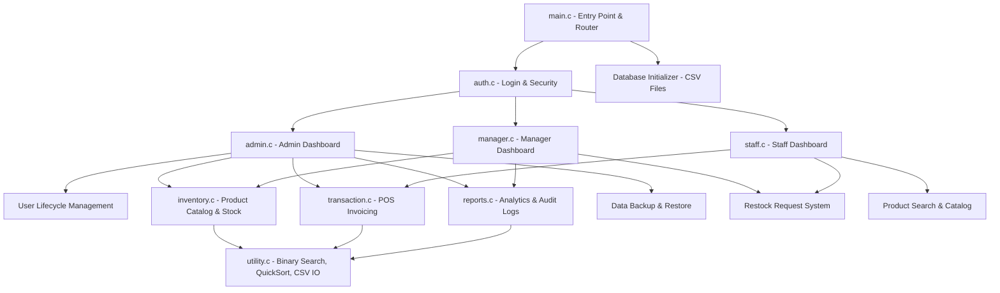

# Stock and Inventory Management System (SIMS) 📦
## Comprehensive System & Technical Documentation

---

## 📋 Table of Contents
1. [Executive Summary](#-executive-summary)
2. [System Architecture](#-system-architecture)
3. [Module Breakdown & File Structure](#-module-breakdown--file-structure)
4. [Role-Based Access Control (RBAC)](#-role-based-access-control-rbac)
5. [Database & CSV Schemas](#-database--csv-schemas)
6. [Core Algorithms & Data Structures](#-core-algorithms--data-structures)
7. [Subsystems Deep-Dive](#-subsystems-deep-dive)
   - [POS Multi-Item Cart & Invoicing](#1-pos-multi-item-cart--invoicing)
   - [Stock Alerts & Inventory Replenishment](#2-stock-alerts--inventory-replenishment)
   - [Authentication, Security & Account Recovery](#3-authentication-security--account-recovery)
   - [Reports Subsystem & Analytics](#4-reports-subsystem--analytics)
8. [Report Generation Fixes & Technical Enhancements](#-report-generation-fixes--technical-enhancements)
9. [Compilation & Deployment Guide](#-compilation--deployment-guide)
10. [Default Credentials & Usage Walkthrough](#-default-credentials--usage-walkthrough)

---

## 🚀 Executive Summary

The **Stock and Inventory Management System (SIMS)** is a modular, high-performance command-line application built in pure **C**. Designed to handle end-to-end retail and inventory operations, SIMS features Role-Based Access Control (RBAC), Point of Sale (POS) multi-item shopping cart processing, dynamic stock alerts, data backup/restore capabilities, system audit logging, and business intelligence reporting.

---

## 🏗️ System Architecture

SIMS uses a modular C architecture where each core domain (authentication, user management, inventory, POS transactions, reporting, and utility functions) is cleanly encapsulated in dedicated source files.



---

## 📂 Module Breakdown & File Structure

```text
SIMS_C/
├── main.c           # Application entry point, system initialization, and role routing
├── utility.c        # Centralized utilities: Binary Search O(log N), QuickSort, CSV parsing, date formatting
├── auth.c           # Authentication, password hashing, security questions, and My Profile management
├── admin.c          # Administrator dashboard, User lifecycle CRUD, and data backup/restore
├── manager.c        # Store Manager dashboard and restocking workflows
├── staff.c          # Sales Staff dashboard and POS navigation
├── inventory.c      # Product Catalog CRUD, inventory table display, and stock alert handling
├── transaction.c    # Multi-item POS cart processing, stock deduction, and transaction logging
├── reports.c        # Business reports (Inventory, Sales Summary, Product Performance) & Audit Trail
│
├── users.csv        # Database: Registered user accounts
├── products.csv     # Database: Product inventory catalog (8 fields)
├── transactions.csv # Database: Itemized sales transaction history (9 fields)
└── audit_log.txt    # Security & system audit log trail
```

---

## 🔐 Role-Based Access Control (RBAC)

SIMS enforces strict permissions based on user role prefixes (`A` for Admin, `M` for Store Manager, `S` for Sales Staff):

| Feature / Subsystem | Admin (`A`) | Manager (`M`) | Sales Staff (`S`) |
|---|:---:|:---:|:---:|
| **User Management** (Add/Delete/View Users) | ✅ Full | ❌ No Access | ❌ No Access |
| **Product CRUD** (Add, Update, Delete Products) | ✅ Full | ✅ Full | 👁️ View Only |
| **Direct Stock Adjustment** (Restock Inventory) | ✅ Full | 📩 Request Only | 📩 Request Only |
| **POS Sales Checkout** (Multi-item Cart) | ✅ Full | ❌ No Access | ✅ Full |
| **View Sales Transactions History** | ✅ Full | ✅ Full | ✅ Full |
| **Reports System** (Inventory, Sales, Performance) | ✅ Full | ✅ Full | ❌ No Access |
| **System Backup & Restore** | ✅ Full | ❌ No Access | ❌ No Access |
| **View Audit Logs** | ✅ Full | ❌ No Access | ❌ No Access |
| **My Profile Management** (Update Name/Password) | ✅ Full | ✅ Full | ✅ Full |

---

## 💾 Database & CSV Schemas

SIMS utilizes persistent, header-formatted CSV flat-file databases.

### 1. `users.csv`
```csv
UserID,FullName,Role,DOB,Email,Password
A100,System Administrator,Admin,01/01/2000,admin@sims.com,1427503930
M100,Asad Manager,Store Manager,10/10/2000,asad@sims.com,1427503930
S100,Masuk Staff,Sales Staff,10/10/2000,masuk@sims.com,1427503930
```

### 2. `products.csv` (8 Fields)
```csv
ProductID,Name,Category,Price,Quantity,MinStock,RestockQty,StockAlert
P001,Laptop,Electronics,1250.00,15,3,0,-
P003,Keyboard,Electronics,89.50,4,5,0,System Low Stock
P005,Headphones,Electronics,55.00,0,5,0,System Out of Stock
P011,Desk,Furniture,380.00,1,3,5,Staff Reported
```

### 3. `transactions.csv` (9 Fields)
```csv
TransactionID,Date,Time,ProductID,ProductName,Quantity,UnitPrice,TotalPrice,SoldBy
T10001,24/07/2026,10:15:00,P001,Laptop,1,1250.00,1250.00,S100
T10002,24/07/2026,11:30:00,P002,Mouse,3,29.99,89.97,S100
```

### 4. `audit_log.txt`
```text
[24/07/2026 10:15:00] [S100] Processed sale transaction T10001
[25/07/2026 08:00:00] [A100] Generated and saved Inventory Report to file
```

---

## ⚡ Core Algorithms & Data Structures

1. **Binary Search ($O(\log N)$)**:
   - `binarySearchProduct()` and `binarySearchUser()` perform case-insensitive binary search on pre-sorted arrays loaded into memory, enabling near-instant product lookup even in large catalogs.

2. **QuickSort ($O(N \log N)$)**:
   - `loadAndSortProducts()` and `loadAndSortUsers()` execute standard C `qsort()` using custom comparator functions (`compareProductsByID` and `compareUsersByID`) before executing binary search or rendering table views.

3. **Date Integer Serialization (`dateToInteger`)**:
   - Date strings formatted as `DD/MM/YYYY` are transformed into comparable `YYYYMMDD` integer values (`y * 10000 + m * 100 + d`), allowing efficient date range filtering for Sales Summary Reports.

---

## 🛠️ Subsystems Deep-Dive

### 1. POS Multi-Item Cart & Invoicing
- **Interactive Shopping Loop**: Cashiers can search products by ID, specify desired quantities, and view live totals.
- **Stock Validation**: Validates available stock quantity before allowing items into the cart.
- **Atomic Checkout**: On checkout confirmation, stock quantities are updated in `products.csv`, sales records are appended to `transactions.csv`, and an itemized printed terminal receipt is displayed.

### 2. Stock Alerts & Inventory Replenishment
- Dynamic stock alert badges automatically updated during catalog views and transactions:
  - `System Low Stock`: Triggered when `Quantity <= MinStock`.
  - `System Out of Stock`: Triggered when `Quantity <= 0`.
  - `Staff Reported`: Triggered when Sales Staff or Managers submit restock reorder requests.

### 3. Authentication, Security & Account Recovery
- **Password Hashing**: Custom non-reversible hash function applied to user passwords prior to saving.
- **4-Tier Account Recovery**: `Forgot Password` requires verification of User ID, Full Name, DOB, and Email.

### 4. Reports Subsystem & Analytics
- **Inventory Report**: Calculates total unique products, total physical units in stock, individual line item valuations, and total inventory value. Option to export formatted report to `inventory_report.txt`.
- **Sales Summary Report**: Filters transaction records across user-specified date ranges (`Start Date` to `End Date`), summarizing total transactions, units sold, line items, and total revenue. Option to export to `sales_report.txt`.
- **Product Performance Report**: Aggregates sales volume and total revenue per product, displaying the Top-Selling Products sorted by volume and revenue. Option to export to `performance_report.txt`.

---

## 🔧 Report Generation Fixes & Technical Enhancements

During system audit and verification, the report generation engine in [reports.c](file:///Users/luhasan/Documents/SIMS_C/SIMS_C/reports.c) was enhanced to fix critical parsing truncation issues:

1. **`struct Product` Field Alignment**:
   - `struct Product` in `reports.c` was missing `char stockAlert[30];`.
   - Updated `struct Product` to match the full 8-field schema present in `products.csv`.

2. **CSV Parsing Truncation Fix**:
   - Previously, `fscanf()` calls in `generateInventoryReport()` and `generatePerformanceReport()` expected 7 CSV columns ending in `%d\n`.
   - Because `products.csv` contains an 8th column (`StockAlert`), `fscanf()` failed to match `\n`, leaving `,StockAlert\n` unparsed in the file buffer and causing subsequent loop iterations to terminate early after reading only 1 product.
   - Fixed by updating format strings to `%[^,],%[^,],%[^,],%lf,%d,%d,%d,%[^\n]\n` and checking return codes (`>= 7`), ensuring all products (`P001` to `P015`+) are read completely.

3. **Performance Report Fallback & Secondary Sorting**:
   - Ensured transaction items for products missing from active inventory are still accounted for in performance metrics.
   - Enhanced sorting logic to sort primarily by `totalSold` descending, with secondary tie-breaking by `totalRevenue` descending.

4. **Line Ending Sanitization**:
   - Added trailing `\r`/`\n` stripping (`strcspn(soldBy, "\r\n")`) when parsing transaction records to ensure cross-platform output formatting on Windows and macOS.

---

## 💻 Compilation & Deployment Guide

### Prerequisites
- Standard C Compiler (**GCC** or **Clang**).
- Cross-platform compatible with macOS, Linux, and Windows.

### Compilation Command

```bash
gcc -Wall main.c utility.c auth.c admin.c manager.c staff.c inventory.c transaction.c reports.c -o sims
```

### Executing the Binary

```bash
# On macOS / Linux
./sims

# On Windows
sims.exe
```

---

## 🔑 Default Credentials & Usage Walkthrough

Upon initial launch, default administrator, manager, and staff accounts are auto-created if `users.csv` does not exist:

| Role | User ID | Default Password | Date of Birth | Email |
|---|---|---|---|---|
| **Administrator** | `A100` | `Admin123` | `01/01/2000` | `admin@sims.com` |
| **Store Manager** | `M100` | `Asad123` | `10/10/2000` | `asad@sims.com` |
| **Sales Staff** | `S100` | `Masuk123` | `10/10/2000` | `masuk@sims.com` |

### Step-by-Step Walkthrough
1. Launch `./sims`.
2. Select `1. Login`.
3. Enter User ID `A100` and Password `Admin123`.
4. Select Option `6. Reports System`:
   - Choice `1`: View full Inventory Valuation Report.
   - Choice `2`: View Sales Summary Report (enter start/end date e.g. `01/01/2026` to `31/12/2026`).
   - Choice `3`: View Product Performance Report (Top-Selling items).
5. Enter `1` when prompted to save any report to a text file (`inventory_report.txt`, `sales_report.txt`, `performance_report.txt`).
